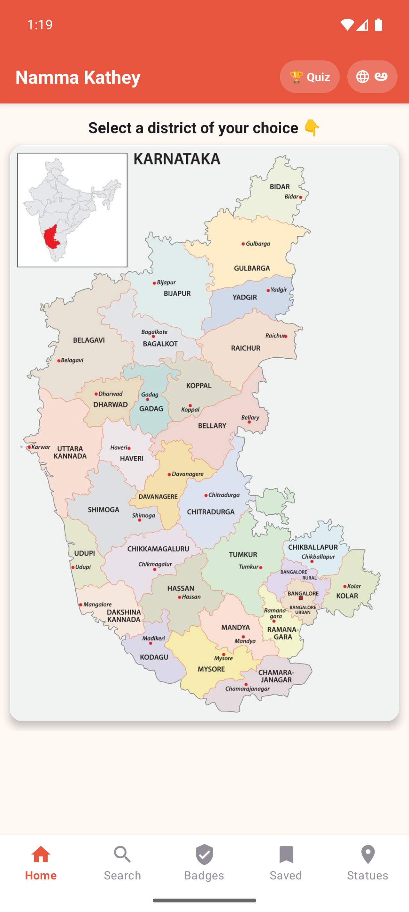
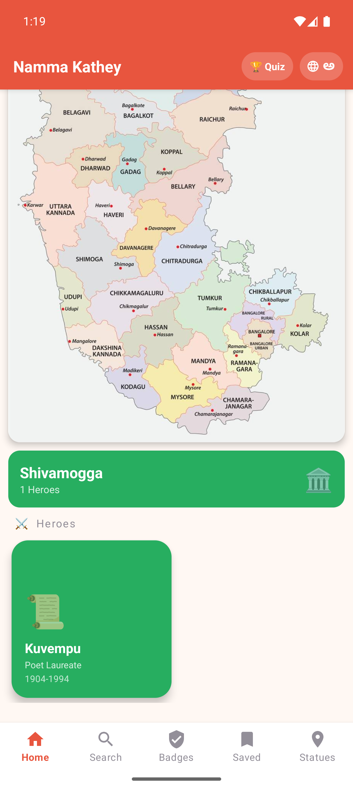
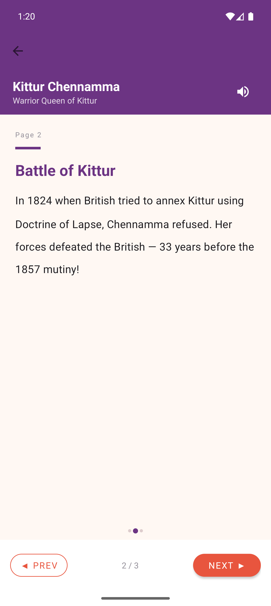
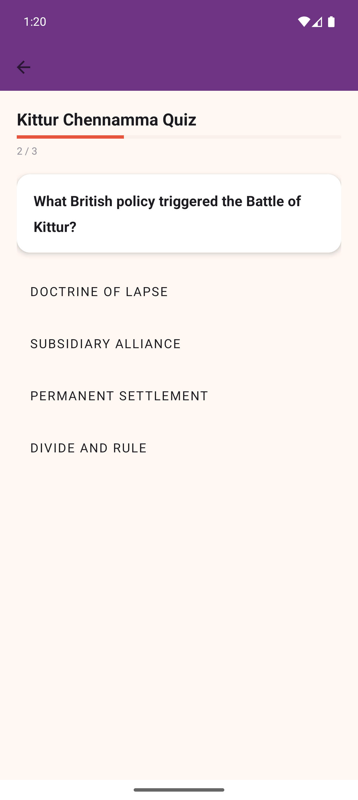
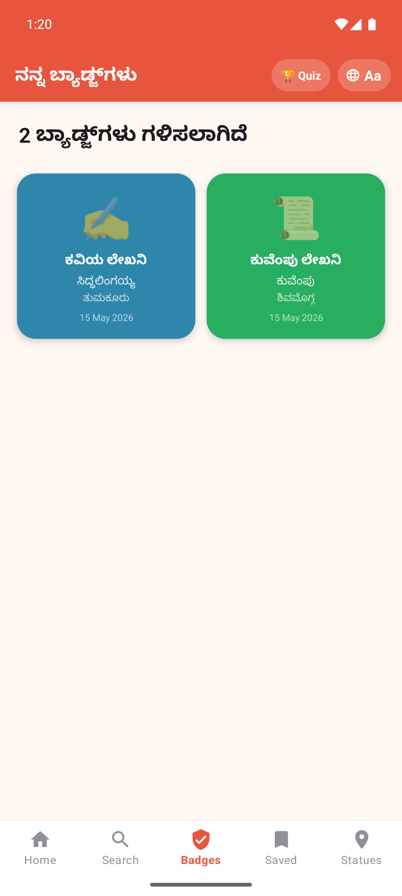
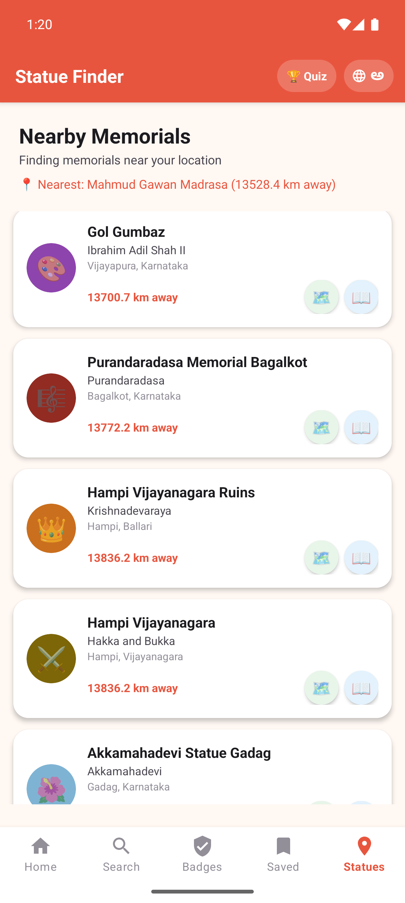

# Namma Kathey

*A Kannada-first interactive learning and quiz application focused on Karnataka’s culture, geography, districts, and regional identity.*

---

## Overview

Namma Kathey is a modern Android application developed to make learning about Karnataka more interactive, accessible, and engaging. The application combines quizzes, bilingual support, district-based visual learning, and a clean UI to create an educational experience targeted toward students and general users interested in Karnataka’s heritage and geography.

The project emphasizes usability, localized content, structured UI design, and scalable architecture while maintaining a lightweight and responsive mobile experience.

This repository contains the complete source code, assets, configurations, and implementation files required to build and run the application locally.

---

## Problem Statement

Many educational applications provide generic quiz systems without localized cultural relevance or regional language accessibility. Namma Kathey addresses this gap by providing:

* Kannada + English bilingual learning support
* District-based educational interaction
* Visual learning through color-coded regional mapping
* Interactive quiz mechanics with dynamic question handling
* Mobile-first responsive experience

---

## Key Features

### Quiz System

* Multiple-choice interactive quizzes
* Dynamic question rendering
* Randomized option shuffling
* Correct answer index recalculation
* Category-wise question organization
* Score tracking and result evaluation

### Kannada Language Support

* Full Kannada question translations
* Dual-language content handling
* Language switching support
* Localized educational experience

### Karnataka District Mapping

* District-specific color mapping
* Region-based UI representation
* Visual geographic association for learning
* Customized district color handling

### Modern Android UI

* Clean Material-based interface
* Responsive layouts
* Structured navigation flow
* Smooth activity/page transitions
* User-friendly interaction design

### Data & Content Management

* Structured question dataset handling
* Organized resource management
* Efficient content rendering
* Scalable architecture for adding future quizzes/modules

### WhatsApp Deep Linking Integration

* Direct WhatsApp communication support
* Pre-filled dynamic messages
* Automatic phone formatting utilities
* Intent-based external app navigation

### Project Architecture

* Modular folder structure
* Reusable components and utilities
* Clear separation of concerns
* Organized assets and configuration management

---

## Tech Stack

| Technology                 |
| -------------------------- |
| Kotlin / Java              |
| Android Studio             |
| XML                        |
| Gradle                     |
| Git & GitHub               |
| Material Design Components |

---

## Project Structure

```text
NammaKathey/
│
├── app/
│   ├── src/
│   │   ├── main/
│   │   │   ├── java/
│   │   │   ├── res/
│   │   │   ├── assets/
│   │   │   └── AndroidManifest.xml
│   │
│   ├── build.gradle
│
├── gradle/
├── screenshots/
├── README.md
└── settings.gradle
```

---

## Installation & Setup

### Download APK 

[Download Latest APK](https://github.com/off-s1de/NammaKathey/releases/download/v1/NammaKathey-v1.apk)

### Local

* Android Studio (latest recommended version)
* Android SDK installed
* Git installed

---

### Clone the Repository

```bash
git clone https://github.com/off-s1de/NammaKathey.git
```

---

### Open the Project

1. Open Android Studio
2. Select **Open Existing Project**
3. Choose the cloned repository folder

---

### Build & Run

```bash
./gradlew build
```

Or directly run the project using Android Studio on:

* Android Emulator
* Physical Android Device

---

## Screenshots










---

## Future Improvements

* Leaderboard system
* User authentication
* Progress tracking
* Timed quiz mode
* Additional Karnataka history/culture modules
* Cloud database integration
* Offline-first data synchronization
* Performance analytics dashboard

---

## License

This project is intended for academic and educational purposes.
